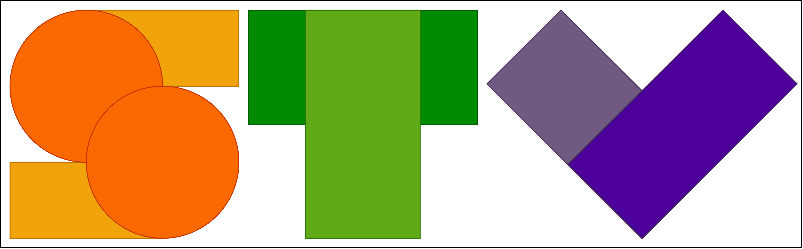

<a name="readme-top"></a>

<!-- PROJECT SHIELDS -->
<!--
*** We are using markdown "reference style" links for readability.
*** Reference links are enclosed in brackets [ ] instead of parentheses ( ).
*** See the bottom of this document for the declaration of the reference variables
*** for contributors-url, forks-url, etc. This is an optional, concise syntax you may use.
*** https://www.markdownguide.org/basic-syntax/#reference-style-links
-->
[![Contributors][contributors-shield]][contributors-url]
[![Forks][forks-shield]][forks-url]
[![Stargazers][stars-shield]][stars-url]
[![Issues][issues-shield]][issues-url]
[![MIT License][license-shield]][license-url]
[![LinkedIn][linkedin-shield]][linkedin-url]


<!-- PROJECT LOGO -->
<br />
<div align="center">
  <a href="https://github.com/christianschuler8989/StudyToolkitVid">
    
  </a>

  <h3 align="center">StudyToolkitVid</h3>

  <p align="center">
    A toolkit for creating studies to evaluate quality of videos!
    <br />
    <a href="https://github.com/christianschuler8989/StudyToolkitVid/tree/main/docs"><strong>Explore the docs »</strong></a>
    <br />
    <br />
    <a href="https://github.com/christianschuler8989/StudyToolkitVid">View Demo (TODO)</a>
    ·
    <a href="https://github.com/christianschuler8989/StudyToolkitVid/issues">Report Bug</a>
    ·
    <a href="https://github.com/christianschuler8989/StudyToolkitVid/issues">Request Feature</a>
  </p>
</div>


<!-- TABLE OF CONTENTS -->
<details>
  <summary>Table of Contents</summary>
  <ol>
    <li>
      <a href="#about-the-project">About The Project</a>
      <ul>
        <li><a href="#built-with">Built With</a></li>
      </ul>
    </li>
    <li>
      <a href="#getting-started">Getting Started</a>
      <ul>
        <li><a href="#prerequisites">Prerequisites</a></li>
        <li><a href="#installation">Installation</a></li>
      </ul>
    </li>
    <li><a href="#usage">Usage</a></li>
    <li><a href="#roadmap">Roadmap</a></li>
    <li><a href="#contributing">Contributing</a></li>
    <li><a href="#license">License</a></li>
    <li><a href="#contact">Contact</a></li>
    <li><a href="#acknowledgments">Acknowledgments</a></li>
  </ol>
</details>


<!-- ABOUT THE PROJECT -->
## About The Project

[![Product Name Screen Shot][product-screenshot]](https://example.com)

Modular concept of the researchers’ toolkit _StudyToolkitVid_. From the formulated research question to the media editing to acquire test material, executing an online study and subsequently analysing the resulting data using statistical methods.

There are many ways to edit media and investigate human perception based on great implementations available online; however, we didn't find one that really suited our needs while investigating the importance of lip synchrony, so we created this toolkit. We wanted to create a toolkit so easy and intuitive to use that it'll enable less tech-savy people to explore their scientific itches. On the other hand we try to keep it as modular as possible to enable adjustments and partial use of it.

Our reasoning:
* Everyone loves freely available and easily accessible software.
* Your time should be focused on creating something amazing while exploring different research questions and not get slowed down by rudimentary issues- trying to solve problems, already solved by others.
* You also shouldn't be doing the same tasks over and over- especially by hand
  + Creating data sets for investigating perceived quality of video material
  + Setting up and executing a user study based on these (or other) data sets
  + Running and reporting a statistical analysis following the results from a study

Of course, no one toolkit will serve all projects since your needs may be different. While our focus is especially on the needs of investigating lip synchrony in video material, we will also try to add more diverse functionalities in the future. You may also suggest changes by forking this repo and creating a pull request or opening an issue. We appreciate all contributions and want to thank everyone who helps out in any way possible!

<p align="right">(<a href="#readme-top">back to top</a>)</p>


### Built With

List of major frameworks/libraries used to bootstrap this project.

* Qt?

<p align="right">(<a href="#readme-top">back to top</a>)</p>


<!-- GETTING STARTED -->
## Getting Started

To get a local copy up and running follow these simple example steps.

### Prerequisites

TODO: Once automated, this section is dropped.
This is an example of how to list things you need to use the software and how to install them.
* npm
  ```sh
  npm install npm@latest -g
  ```

### Installation

TODO: Once automated, this section should be quite short.
_Below is an example of how you can instruct your audience on installing and setting up your app. This template doesn't rely on any external dependencies or services._

1. Get ...
2. Clone the repo
   ```sh
   git clone https://github.com/your_username_/Project-Name.git
   ```
3. Do ...

<p align="right">(<a href="#readme-top">back to top</a>)</p>


<!-- USAGE EXAMPLES -->
## Usage

### Part 1 - Media Editing

Creating data sets for investigating perceived quality of video material


### Part 2 - Study Setup

Setting up and executing a user study based on these (or other) data sets


### Part 3 - Statistical Analysis

Running and reporting a statistical analysis following the results from a study


TODO: Use this space to show useful examples of how a project can be used. Additional screenshots, code examples and demos work well in this space. You may also link to more resources.

_For more examples, please refer to the [Documentation](https://github.com/christianschuler8989/StudyToolkitVid/tree/main/docs)_

<p align="right">(<a href="#readme-top">back to top</a>)</p>


<!-- ROADMAP -->
## Roadmap

- [x] Finally "git-it-up"
- [x] Add Media Editing
    - [ ] Automate
- [x] Add Study Creation
    - [ ] Automate
- [ ] Add Statistical Analysis
    - [ ] Automate
- [ ] Add Automated Installation
- [ ] Add Tests
    - [ ] Different Operating Systems
- [ ] Add Usage Examples
- [ ] Multi-language Support
    - [x] English
    - [ ] German
    - [ ] Chinese
    - [ ] Spanish

See the TODO: [open issues](https://github.com/christianschuler8989/StudyToolkitVid/issues) for a full list of proposed features (and known issues).

<p align="right">(<a href="#readme-top">back to top</a>)</p>


<!-- CONTRIBUTING -->
## Contributing

Contributions are what make the open source community such an amazing place to learn, inspire, and create. Any contributions you make are **greatly appreciated**.

If you have a suggestion that would make this better, please fork the repo and create a pull request. You can also simply open an issue with the tag "enhancement".
Don't forget to give the project a star! Thanks again!

1. Fork the Project
2. Create your Feature Branch (`git checkout -b feature/AmazingFeature`)
3. Commit your Changes (`git commit -m 'Add some AmazingFeature'`)
4. Push to the Branch (`git push origin feature/AmazingFeature`)
5. Open a Pull Request

<p align="right">(<a href="#readme-top">back to top</a>)</p>


<!-- LICENSE -->
## License

Distributed under the GNU License. See `LICENSE.txt` for more information.

<p align="right">(<a href="#readme-top">back to top</a>)</p>


<!-- CONTACT -->
## Contact

Christian Schuler - [@christians89898](https://twitter.com/christians89898) - christianschuler8989(4T)gmail.com

Dominik Hauser - 

<p align="right">(<a href="#readme-top">back to top</a>)</p>


<!-- ACKNOWLEDGMENTS -->
## Acknowledgments

A list of helpful resources we would like to give credit to:

* [Digital and Data Literacy in Teaching Lab](https://www.isa.uni-hamburg.de/ddlitlab.html)
* [Best-README-Template](https://github.com/othneildrew/Best-README-Template) 

<p align="right">(<a href="#readme-top">back to top</a>)</p>


<!-- MARKDOWN LINKS & IMAGES -->
<!-- https://www.markdownguide.org/basic-syntax/#reference-style-links -->
[contributors-shield]: https://img.shields.io/github/contributors/christianschuler8989/StudyToolkitVid.svg?style=for-the-badge
[contributors-url]: https://github.com/christianschuler8989/StudyToolkitVid/graphs/contributors
[forks-shield]: https://img.shields.io/github/forks/christianschuler8989/StudyToolkitVid.svg?style=for-the-badge
[forks-url]: https://github.com/christianschuler8989/StudyToolkitVid/network/members
[stars-shield]: https://img.shields.io/github/stars/christianschuler8989/StudyToolkitVid.svg?style=for-the-badge
[stars-url]: https://github.com/christianschuler8989/StudyToolkitVid/stargazers
[issues-shield]: https://img.shields.io/github/issues/christianschuler8989/StudyToolkitVid.svg?style=for-the-badge
[issues-url]: https://github.com/christianschuler8989/StudyToolkitVid/issues
[license-shield]: https://img.shields.io/github/license/christianschuler8989/StudyToolkitVid.svg?style=for-the-badge
[license-url]: https://github.com/christianschuler8989/StudyToolkitVid/blob/main/LICENSE
[linkedin-shield]: https://img.shields.io/badge/-LinkedIn-black.svg?style=for-the-badge&logo=linkedin&colorB=555
[linkedin-url]: https://www.linkedin.com/in/christian-schuler-59090a177/
[product-screenshot]: images/screenshot.png


